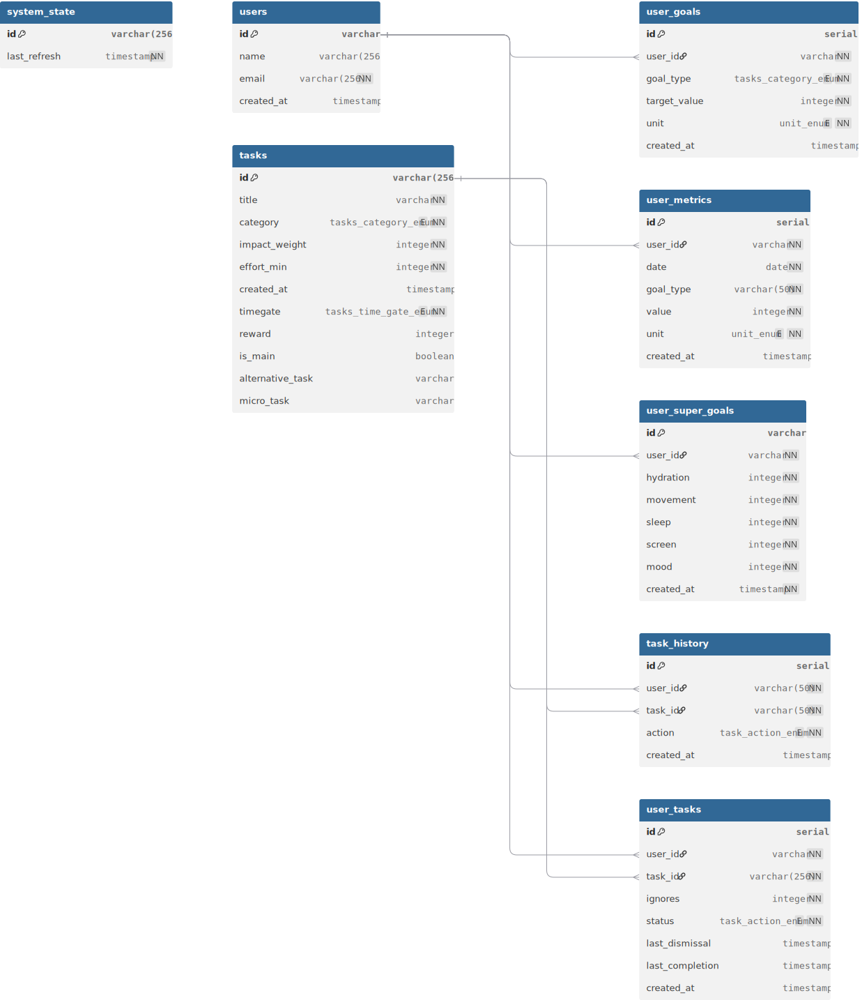

# Wellness Tracking Database Schema

## Overview

This database schema supports a comprehensive wellness and habit tracking application that helps users monitor and improve their daily wellness activities across multiple categories including hydration, movement, sleep, screen time, and mood tracking.

## Database Diagram

🔗 **Interactive Database Diagram**: [View on dbdiagram.io](https://dbdiagram.io/d/68d95082d2b621e4224255e6)

🔗 **Schema Implementation**: [Schemas file](../index.ts)

## Schema Components

### Enums

#### `task_action_enum`
Defines the possible actions users can take on tasks.
- `pending` - Task is awaiting user action
- `dismiss` - User has dismissed the task for now
- `complete` - User has completed the task
- `ignore` - User has chosen to ignore the task

#### `tasks_category_enum`
Categorizes different types of wellness tasks.
- `hydration` - Water intake related tasks
- `movement` - Physical activity and exercise tasks
- `sleep` - Sleep quality and duration tasks
- `screen` - Screen time management tasks
- `mood` - Mental health and mood tracking tasks

#### `tasks_time_gate_enum`
Defines when tasks should be presented to users.
- `morning` - Tasks for morning routine
- `evening` - Tasks for evening routine
- `afternoon` - Tasks for afternoon activities
- `anytime` - Tasks that can be done at any time

#### `unit_enum`
Measurement units for goals and metrics.
- `ml` - Milliliters (for hydration)
- `steps` - Step count (for movement)
- `hours` - Hours (for sleep)
- `minutes` - Minutes (for screen time)
- `mood` - Mood scale value

### Core Tables

#### `users`
Stores basic user account information.

| Column | Type | Constraints | Description |
|--------|------|-------------|-------------|
| `id` | `varchar` | PRIMARY KEY, UNIQUE | User identifier |
| `name` | `varchar(256)` | | User's display name |
| `email` | `varchar(256)` | NOT NULL, UNIQUE | User's email address |
| `created_at` | `timestamp` | DEFAULT now() | Account creation timestamp |

#### `tasks`
Defines all available wellness tasks in the system.

| Column | Type | Constraints | Description |
|--------|------|-------------|-------------|
| `id` | `varchar(256)` | PRIMARY KEY, UNIQUE | Task identifier |
| `title` | `varchar` | NOT NULL | Task title/description |
| `category` | `tasks_category_enum` | NOT NULL | Task category |
| `impact_weight` | `integer` | NOT NULL | Relative importance weight |
| `effort_min` | `integer` | NOT NULL | Minimum effort required (minutes) |
| `created_at` | `timestamp` | DEFAULT now() | Task creation timestamp |
| `timegate` | `tasks_time_gate_enum` | NOT NULL, DEFAULT 'anytime' | When task should be shown |
| `reward` | `integer` | | Points awarded for completion |
| `is_main` | `boolean` | DEFAULT true | Whether this is a primary task |
| `alternative_task` | `varchar` | | Reference to alternative task |
| `micro_task` | `varchar` | | Reference to smaller version of task |

#### `system_state`
Tracks system-level state information.

| Column | Type | Constraints | Description |
|--------|------|-------------|-------------|
| `id` | `varchar(256)` | PRIMARY KEY | System component identifier |
| `last_refresh` | `timestamp` | NOT NULL | Last system refresh time |

### User Progress Tables

#### `user_tasks`
Links users to tasks and tracks their engagement status.

| Column | Type | Constraints | Description |
|--------|------|-------------|-------------|
| `id` | `serial` | PRIMARY KEY | Auto-incrementing ID |
| `user_id` | `varchar` | NOT NULL, FK → users.id | User reference |
| `task_id` | `varchar(256)` | NOT NULL, FK → tasks.id | Task reference |
| `ignores` | `integer` | NOT NULL, DEFAULT 0 | Number of times ignored |
| `status` | `task_action_enum` | NOT NULL, DEFAULT 'pending' | Current task status |
| `last_dismissal` | `timestamp` | | Last dismissal time |
| `last_completion` | `timestamp` | | Last completion time |
| `created_at` | `timestamp` | DEFAULT now() | Record creation time |

#### `task_history`
Maintains a complete audit trail of all user task interactions.

| Column | Type | Constraints | Description |
|--------|------|-------------|-------------|
| `id` | `serial` | PRIMARY KEY | Auto-incrementing ID |
| `user_id` | `varchar(50)` | NOT NULL, FK → users.id | User reference |
| `task_id` | `varchar(50)` | NOT NULL, FK → tasks.id | Task reference |
| `action` | `task_action_enum` | NOT NULL | Action taken by user |
| `created_at` | `timestamp` | DEFAULT now() | Action timestamp |

#### `user_goals`
Stores individual user goals for each wellness category.

| Column | Type | Constraints | Description |
|--------|------|-------------|-------------|
| `id` | `serial` | PRIMARY KEY | Auto-incrementing ID |
| `user_id` | `varchar` | NOT NULL, FK → users.id | User reference |
| `goal_type` | `tasks_category_enum` | NOT NULL | Type of goal |
| `target_value` | `integer` | NOT NULL | Target value to achieve |
| `unit` | `unit_enum` | NOT NULL | Measurement unit |
| `created_at` | `timestamp` | DEFAULT now() | Goal creation time |

**Unique Constraint**: `(user_id, goal_type)` - One goal per category per user.

#### `user_metrics`
Records daily measurements and progress data.

| Column | Type | Constraints | Description |
|--------|------|-------------|-------------|
| `id` | `serial` | PRIMARY KEY | Auto-incrementing ID |
| `user_id` | `varchar` | NOT NULL, FK → users.id | User reference |
| `date` | `date` | NOT NULL | Date of measurement |
| `goal_type` | `varchar(50)` | NOT NULL | Type of metric |
| `value` | `integer` | NOT NULL | Recorded value |
| `unit` | `unit_enum` | NOT NULL | Measurement unit |
| `created_at` | `timestamp` | DEFAULT now() | Record creation time |

#### `user_super_goals`
Master goal settings with default values for all wellness categories.

| Column | Type | Constraints | Description |
|--------|------|-------------|-------------|
| `id` | `varchar` | PRIMARY KEY | Goal set identifier |
| `user_id` | `varchar` | NOT NULL, UNIQUE, FK → users.id | User reference |
| `hydration` | `integer` | NOT NULL, DEFAULT 2400 | Daily hydration goal (ml) |
| `movement` | `integer` | NOT NULL, DEFAULT 8000 | Daily movement goal (steps) |
| `sleep` | `integer` | NOT NULL, DEFAULT 8 | Daily sleep goal (hours) |
| `screen` | `integer` | NOT NULL, DEFAULT 120 | Daily screen limit (minutes) |
| `mood` | `integer` | NOT NULL, DEFAULT 0 | Mood target value |
| `created_at` | `timestamp` | NOT NULL, DEFAULT now() | Record creation time |

## Relationships

### One-to-Many Relationships
- `users` → `task_history` (One user has many task actions)
- `users` → `user_goals` (One user has many goals)
- `users` → `user_metrics` (One user has many metric records)
- `users` → `user_tasks` (One user has many task assignments)
- `tasks` → `task_history` (One task has many user actions)
- `tasks` → `user_tasks` (One task can be assigned to many users)

### One-to-One Relationships
- `users` → `user_super_goals` (One user has one set of super goals)

## Key Features

### Task Management
- **Time-gated Tasks**: Tasks can be scheduled for specific times of day
- **Impact Weighting**: Tasks have configurable importance levels
- **Effort Estimation**: Minimum time requirements help users plan
- **Alternative Tasks**: Fallback options for main tasks
- **Micro Tasks**: Smaller versions of tasks for easier completion

### Progress Tracking
- **Action History**: Complete audit trail of all user interactions
- **Ignore Tracking**: Monitors how often users skip tasks
- **Completion Tracking**: Records when and how often tasks are completed
- **Daily Metrics**: Captures actual measurements vs. goals

### Goal System
- **Flexible Goals**: Individual goals per wellness category
- **Default Settings**: System-wide defaults in super goals
- **Multiple Units**: Support for various measurement types
- **Category-based**: Organized by wellness domains

## Default Values

The system includes sensible defaults for new users:
- **Hydration**: 2400ml daily
- **Movement**: 8000 steps daily  
- **Sleep**: 8 hours daily
- **Screen Time**: 120 minutes daily limit
- **Mood**: 0 (baseline)

## Usage Patterns

### Daily Workflow
1. System presents time-gated tasks based on current time
2. Users interact with tasks (complete, dismiss, or ignore)
3. All actions are logged in task history
4. Daily metrics are recorded for progress tracking
5. System adjusts task recommendations based on user patterns

### Analytics & Insights
- Track completion rates by task and category
- Monitor ignore patterns to identify problematic tasks
- Analyze progress toward goals over time
- Identify peak performance times and patterns

## Database Considerations

### Performance
- Indexed foreign keys for efficient joins
- Composite unique constraints for data integrity
- Serial primary keys for optimal insertion performance

### Data Integrity
- Foreign key constraints maintain referential integrity
- Enum types ensure valid status values
- Unique constraints prevent duplicate goals per user

### Scalability
- Separate tables for different data access patterns
- History table for audit requirements
- Metrics table designed for time-series data

---

*This schema supports a comprehensive wellness tracking application with flexible task management, detailed progress tracking, and robust goal-setting capabilities.*